# Bounded Contexts for Chiro ERP System

## Overview
This document defines the bounded contexts for the consolidated Chiro ERP system, following Domain-Driven Design (DDD) principles. Each bounded context represents a specific business domain with its own ubiquitous language, data models, and business rules.

## Bounded Context Architecture

```mermaid
graph TB
    subgraph "Core Platform Context"
        CP[Core Platform Service]
        CP --> CPIdentity[Identity Domain]
        CP --> CPOrg[Organization Domain]
    end
    
    subgraph "Customer Relationship Context"
        CRM[Customer Relationship Service]
        CRM --> CRMCore[CRM Domain]
        CRM --> CRMClient[Client Management Domain]
        CRM --> CRMProvider[Provider Management Domain]
        CRM --> CRMSub[Subscription Domain]
        CRM --> CRMPromo[Promotion Domain]
    end
    
    subgraph "Operations Context"
        OPS[Operations Service]
        OPS --> OPSField[Field Service Domain]
        OPS --> OPSSchedule[Scheduling Domain]
        OPS --> OPSRecords[Records Domain]
        OPS --> OPSRepair[Repair/RMA Domain]
    end
    
    subgraph "Commerce Context"
        ECOM[Ecommerce Experience Service]
        ECOM --> ECOMStore[Storefront Domain]
        ECOM --> ECOMPortal[Portal Domain]
        ECOM --> ECOMComm[Communication Domain]
    end
    
    subgraph "Financial Context"
        FIN[Financial Management Service]
        FIN --> FINBill[Billing Domain]
        FIN --> FINAP[AP Automation Domain]
    end
    
    subgraph "Supply Chain Context"
        SCM[Supply Chain Manufacturing Service]
        SCM --> SCMProd[Production Domain]
        SCM --> SCMQuality[Quality Domain]
        SCM --> SCMInventory[Inventory Domain]
    end
    
    subgraph "Logistics Context"
        LOG[Logistics Transportation Service]
        LOG --> LOGFleet[Fleet Domain]
        LOG --> LOGTMS[TMS Domain]
        LOG --> LOGWMS[WMS Domain]
    end
    
    subgraph "Analytics Context"
        ANA[Analytics Intelligence Service]
        ANA --> ANAData[Data Products Domain]
        ANA --> ANAAI[AI/ML Domain]
        ANA --> ANAReport[Reporting Domain]
    end
```

## 1. Core Platform Bounded Context

### **Context Name**: Core Platform
### **Service**: `core-platform`
### **Purpose**: Foundation services for identity, security, and organizational structure

#### Domains:
- **Identity Domain** (`identity/`)
  - **Responsibility**: User authentication, authorization, role-based access control
  - **Key Aggregates**: User, Role, Permission, Session
  - **Ubiquitous Language**: User, Authentication, Authorization, RBAC, Session, Token

- **Organization Domain** (`organization/`)
  - **Responsibility**: Multi-tenant organization management, hierarchical structures
  - **Key Aggregates**: Organization, Tenant, Department, Hierarchy
  - **Ubiquitous Language**: Tenant, Organization, Department, Hierarchy, Structure

#### Context Boundaries:
- **Inbound**: All other contexts depend on Core Platform for authentication
- **Outbound**: May integrate with external identity providers (LDAP, OAuth)
- **Data Ownership**: User identities, organizational structures, permissions

---

## 2. Customer Relationship Bounded Context

### **Context Name**: Customer Relationship Management
### **Service**: `customer-relationship`
### **Purpose**: Managing all customer-related interactions and relationships

#### Domains:
- **CRM Domain** (`crm/`)
  - **Responsibility**: Customer lifecycle management, interactions, sales pipeline
  - **Key Aggregates**: Customer, Lead, Opportunity, Contact, Activity
  - **Ubiquitous Language**: Customer, Lead, Opportunity, Pipeline, Contact, Activity

- **Client Management Domain** (`client/`)
  - **Responsibility**: Client onboarding, profile management, relationship tracking
  - **Key Aggregates**: Client, ClientProfile, Relationship, Agreement
  - **Ubiquitous Language**: Client, Profile, Relationship, Agreement, Onboarding

- **Provider Management Domain** (`provider/`)
  - **Responsibility**: Vendor and supplier relationship management
  - **Key Aggregates**: Provider, Vendor, Supplier, Contract, Performance
  - **Ubiquitous Language**: Provider, Vendor, Supplier, Contract, Performance

- **Subscription Domain** (`subscription/`)
  - **Responsibility**: Subscription lifecycle, billing cycles, plan management
  - **Key Aggregates**: Subscription, Plan, BillingCycle, Usage
  - **Ubiquitous Language**: Subscription, Plan, Billing Cycle, Usage, Renewal

- **Promotion Domain** (`promotion/`)
  - **Responsibility**: Marketing campaigns, discounts, loyalty programs
  - **Key Aggregates**: Promotion, Campaign, Discount, LoyaltyProgram
  - **Ubiquitous Language**: Promotion, Campaign, Discount, Loyalty, Reward

#### Context Boundaries:
- **Inbound**: Receives customer data from ecommerce, field operations
- **Outbound**: Publishes customer events to analytics, financial contexts
- **Data Ownership**: Customer data, relationships, subscription information

---

## 3. Operations Bounded Context

### **Context Name**: Field Operations & Service Management
### **Service**: `operations-service`
### **Purpose**: Managing field operations, scheduling, and service delivery

#### Domains:
- **Field Service Domain** (`field-service/`)
  - **Responsibility**: Field service operations, technician management, service delivery
  - **Key Aggregates**: ServiceOrder, Technician, WorkOrder, ServiceTicket
  - **Ubiquitous Language**: Service Order, Technician, Work Order, Service Ticket, Field Service

- **Scheduling Domain** (`scheduling/`)
  - **Responsibility**: Resource scheduling, appointment management, capacity planning
  - **Key Aggregates**: Schedule, Appointment, Resource, Capacity
  - **Ubiquitous Language**: Schedule, Appointment, Resource, Capacity, Availability

- **Records Domain** (`records/`)
  - **Responsibility**: Document management, compliance records, audit trails
  - **Key Aggregates**: Document, Record, Audit, Compliance
  - **Ubiquitous Language**: Document, Record, Audit, Compliance, Archive

- **Repair/RMA Domain** (`repair-rma/`)
  - **Responsibility**: Return merchandise authorization, repair workflows
  - **Key Aggregates**: RMA, RepairOrder, ReturnItem, Warranty
  - **Ubiquitous Language**: RMA, Repair Order, Return, Warranty, Refurbish

#### Context Boundaries:
- **Inbound**: Receives service requests from customer context, inventory updates
- **Outbound**: Updates inventory, billing contexts with service completion
- **Data Ownership**: Service orders, schedules, repair records

---

## 4. Commerce Bounded Context

### **Context Name**: E-commerce & Customer Experience
### **Service**: `ecommerce-experience`
### **Purpose**: Customer-facing commerce and communication platforms

#### Domains:
- **Storefront Domain** (`storefront/`)
  - **Responsibility**: Online catalog, shopping cart, order placement
  - **Key Aggregates**: Product, Cart, Order, Catalog
  - **Ubiquitous Language**: Product, Cart, Order, Catalog, Checkout

- **Portal Domain** (`portal/`)
  - **Responsibility**: Customer self-service portal, account management
  - **Key Aggregates**: CustomerAccount, Portal, Dashboard, SelfService
  - **Ubiquitous Language**: Customer Account, Portal, Dashboard, Self-Service

- **Communication Domain** (`communication/`)
  - **Responsibility**: Customer communications, notifications, messaging
  - **Key Aggregates**: Message, Notification, Communication, Channel
  - **Ubiquitous Language**: Message, Notification, Communication, Channel, Template

#### Context Boundaries:
- **Inbound**: Product data from inventory, customer data from CRM
- **Outbound**: Orders to fulfillment, customer interactions to CRM
- **Data Ownership**: Shopping sessions, customer portal data, communications

---

## 5. Financial Bounded Context

### **Context Name**: Financial Management
### **Service**: `financial-management`
### **Purpose**: Financial transactions, billing, and accounts payable automation

#### Domains:
- **Billing Domain** (`billing/`)
  - **Responsibility**: Invoice generation, payment processing, revenue recognition
  - **Key Aggregates**: Invoice, Payment, BillingCycle, Revenue
  - **Ubiquitous Language**: Invoice, Payment, Billing, Revenue, Collection

- **AP Automation Domain** (`ap-automation/`)
  - **Responsibility**: Accounts payable automation, vendor payments, expense management
  - **Key Aggregates**: APInvoice, Payment, Expense, Approval
  - **Ubiquitous Language**: AP Invoice, Payment, Expense, Approval, Workflow

#### Context Boundaries:
- **Inbound**: Billing events from subscriptions, expense data from operations
- **Outbound**: Payment confirmations to customer context, financial data to analytics
- **Data Ownership**: Financial transactions, invoices, payment records

---

## 6. Supply Chain Bounded Context

### **Context Name**: Supply Chain & Manufacturing
### **Service**: `supply-chain-manufacturing`
### **Purpose**: Production planning, quality management, and inventory control

#### Domains:
- **Production Domain** (`production/`)
  - **Responsibility**: Manufacturing resource planning, production scheduling
  - **Key Aggregates**: ProductionOrder, BOM, WorkCenter, Schedule
  - **Ubiquitous Language**: Production Order, BOM, Work Center, Manufacturing, MRP

- **Quality Domain** (`quality/`)
  - **Responsibility**: Quality control, testing, compliance management
  - **Key Aggregates**: QualityPlan, Inspection, TestResult, NonConformance
  - **Ubiquitous Language**: Quality Plan, Inspection, Test, Non-Conformance, Compliance

- **Inventory Domain** (`inventory/`)
  - **Responsibility**: Stock management, warehousing, inventory tracking
  - **Key Aggregates**: Item, Stock, Location, Movement
  - **Ubiquitous Language**: Item, Stock, Location, Movement, Availability

#### Context Boundaries:
- **Inbound**: Production demands from orders, quality requirements
- **Outbound**: Inventory updates to ecommerce, quality reports to operations
- **Data Ownership**: Inventory levels, production schedules, quality records

---

## 7. Logistics Bounded Context

### **Context Name**: Logistics & Transportation
### **Service**: `logistics-transportation`
### **Purpose**: Fleet management, transportation, and warehouse operations

#### Domains:
- **Fleet Domain** (`fleet/`)
  - **Responsibility**: Vehicle management, maintenance, driver assignments
  - **Key Aggregates**: Vehicle, Driver, Maintenance, Route
  - **Ubiquitous Language**: Vehicle, Driver, Maintenance, Route, Fleet

- **TMS Domain** (`tms/`)
  - **Responsibility**: Transportation management, shipment tracking, carrier management
  - **Key Aggregates**: Shipment, Carrier, Route, Delivery
  - **Ubiquitous Language**: Shipment, Carrier, Route, Delivery, Transportation

- **WMS Domain** (`wms/`)
  - **Responsibility**: Advanced warehouse management, picking, packing, shipping
  - **Key Aggregates**: Warehouse, Pick, Pack, Ship, Location
  - **Ubiquitous Language**: Warehouse, Pick, Pack, Ship, Location, Fulfillment

#### Context Boundaries:
- **Inbound**: Shipment requirements from orders, inventory locations
- **Outbound**: Delivery confirmations to customers, inventory movements
- **Data Ownership**: Fleet data, shipments, warehouse operations

---

## 8. Analytics Bounded Context

### **Context Name**: Analytics & Business Intelligence
### **Service**: `analytics-intelligence`
### **Purpose**: Data analytics, machine learning, and business reporting

#### Domains:
- **Data Products Domain** (`data-products/`)
  - **Responsibility**: Data pipeline management, data product creation
  - **Key Aggregates**: DataPipeline, DataProduct, Dataset, ETLJob
  - **Ubiquitous Language**: Data Pipeline, Data Product, Dataset, ETL, Transformation

- **AI/ML Domain** (`ai-ml/`)
  - **Responsibility**: Machine learning models, predictions, AI services
  - **Key Aggregates**: Model, Prediction, Algorithm, Training
  - **Ubiquitous Language**: Model, Prediction, Algorithm, Training, Inference

- **Reporting Domain** (`reporting/`)
  - **Responsibility**: Business intelligence, dashboards, analytical reports
  - **Key Aggregates**: Report, Dashboard, Metric, KPI
  - **Ubiquitous Language**: Report, Dashboard, Metric, KPI, Analytics

#### Context Boundaries:
- **Inbound**: Data from all other contexts for analysis
- **Outbound**: Insights and reports back to business contexts
- **Data Ownership**: Analytical models, reports, business intelligence data

---

## Context Integration Patterns

### Anti-Corruption Layer (ACL)
Each bounded context implements ACLs when integrating with external contexts to maintain domain integrity.

### Published Language
Common event schemas and API contracts are defined in the `libs/integration-contracts` module.

### Shared Kernel
Common domain concepts are shared through the `libs/domain-events` module.

### Context Map Relationships
- **Core Platform** → Upstream to all contexts (authentication)
- **Customer Relationship** ↔ **Commerce** (customer data sharing)
- **Operations** → **Financial** (service completion → billing)
- **Supply Chain** → **Logistics** (inventory → shipment)
- **Analytics** ← All contexts (data consumption)

## Implementation Guidelines

### 1. Domain Purity
- Keep domain models free from infrastructure concerns
- Use domain services for complex business logic
- Implement rich domain models with behavior

### 2. Context Communication
- Use asynchronous messaging for inter-context communication
- Implement saga patterns for distributed transactions
- Define clear APIs for synchronous communication

### 3. Data Consistency
- Each context owns its data
- Use eventual consistency between contexts
- Implement compensating actions for failures

### 4. Evolution Strategy
- Design for context splitting as domains grow
- Use strangler fig pattern for legacy migration
- Maintain backward compatibility in published contracts

## Next Steps

1. **Review and Validate**: Have domain experts review each bounded context
2. **Define Context Maps**: Create detailed context mapping between domains
3. **Implement ACLs**: Build anti-corruption layers for external integrations
4. **Create Event Schemas**: Define domain events for inter-context communication
5. **Setup Infrastructure**: Implement hexagonal architecture for each domain
