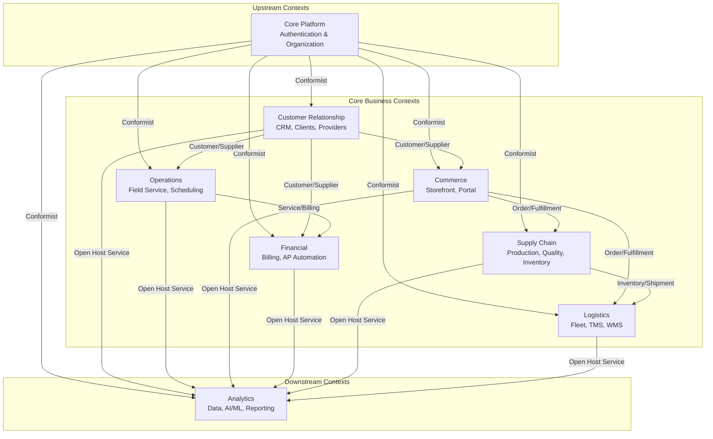

# Context Mapping for Chiro ERP System

## Overview
This document defines the relationships between bounded contexts in the Chiro ERP system, following the Context Mapping patterns from Domain-Driven Design.

## Context Map



## Context Relationships

### 1. Core Platform as Upstream Context

#### **Pattern**: Conformist
**Description**: All other contexts must conform to Core Platform's authentication and organization model.

**Relationships**:
- **Core Platform** ⬇️ All Other Contexts
  - **Type**: Upstream/Downstream - Conformist
  - **Reason**: Authentication and authorization are foundational requirements
  - **Integration**: JWT tokens, user context, organization hierarchy

**Published Language**:
```kotlin
// Authentication Context
data class UserContext(
    val userId: UserId,
    val tenantId: TenantId,
    val roles: Set<Role>,
    val permissions: Set<Permission>
)

// Organization Context  
data class OrganizationContext(
    val tenantId: TenantId,
    val organizationId: OrganizationId,
    val hierarchy: OrganizationPath
)
```

---

### 2. Customer Relationship ↔ Commerce Partnership

#### **Pattern**: Customer/Supplier
**Description**: Mutual dependency between customer management and commerce operations.

**Customer Relationship** as **Customer**:
- Consumes product catalog from Commerce
- Consumes order information for customer relationship tracking

**Customer Relationship** as **Supplier**:
- Provides customer profiles and preferences
- Provides subscription and promotion data

**Shared Concepts**:
```kotlin
// Customer in CRM Context
data class Customer(
    val customerId: CustomerId,
    val profile: CustomerProfile,
    val preferences: CustomerPreferences
)

// Customer in Commerce Context (different model)
data class ShopperProfile(
    val customerId: CustomerId, // Reference to CRM
    val shoppingPreferences: ShoppingPreferences,
    val cartHistory: List<CartSnapshot>
)
```

**Anti-Corruption Layer**:
```kotlin
// In Commerce Context
class CustomerACL(
    private val crmCustomerService: CRMCustomerService
) {
    fun toShopperProfile(customer: CRMCustomer): ShopperProfile {
        return ShopperProfile(
            customerId = customer.id,
            shoppingPreferences = mapToShoppingPreferences(customer.preferences),
            cartHistory = emptyList() // Commerce owns this
        )
    }
}
```

---

### 3. Operations ↔ Financial Partnership

#### **Pattern**: Customer/Supplier
**Description**: Operations consume financial data and supply billing events.

**Operations** as **Customer**:
- Consumes billing rates and cost information
- Consumes payment status for service authorization

**Operations** as **Supplier**:
- Provides service completion events for billing
- Provides expense data for AP automation

**Domain Events**:
```kotlin
// From Operations to Financial
data class ServiceCompletedEvent(
    val serviceOrderId: ServiceOrderId,
    val customerId: CustomerId,
    val serviceItems: List<BillableServiceItem>,
    val completedAt: Instant
)

// From Financial to Operations
data class PaymentReceivedEvent(
    val invoiceId: InvoiceId,
    val customerId: CustomerId,
    val amount: Money,
    val paidAt: Instant
)
```

---

### 4. Supply Chain ↔ Logistics Partnership

#### **Pattern**: Customer/Supplier
**Description**: Supply Chain supplies inventory for shipment, Logistics provides fulfillment capabilities.

**Supply Chain** as **Supplier**:
- Provides inventory availability
- Provides pick/pack instructions

**Logistics** as **Customer**:
- Consumes inventory locations
- Consumes shipment requirements

**Shared Concepts**:
```kotlin
// Inventory in Supply Chain Context
data class InventoryItem(
    val itemId: ItemId,
    val quantity: Quantity,
    val location: WarehouseLocation,
    val availability: AvailabilityStatus
)

// Shipment Item in Logistics Context
data class ShipmentItem(
    val itemId: ItemId, // Reference to Supply Chain
    val quantity: Quantity,
    val pickLocation: PickLocation,
    val packingInstructions: PackingInstructions
)
```

---

### 5. Commerce → Supply Chain Integration

#### **Pattern**: Customer/Supplier
**Description**: Commerce places demands on Supply Chain for order fulfillment.

**Integration Points**:
- Order placement triggers production/inventory allocation
- Inventory availability affects product catalog display
- Product information flows from Supply Chain to Commerce

**Domain Events**:
```kotlin
// From Commerce to Supply Chain
data class OrderPlacedEvent(
    val orderId: OrderId,
    val customerId: CustomerId,
    val items: List<OrderItem>,
    val requiredBy: LocalDate
)

// From Supply Chain to Commerce
data class InventoryUpdatedEvent(
    val itemId: ItemId,
    val newQuantity: Quantity,
    val availability: AvailabilityStatus
)
```

---

### 6. Analytics as Open Host Service

#### **Pattern**: Open Host Service
**Description**: Analytics provides analytical services to all business contexts.

**Services Provided**:
- Customer analytics and insights
- Operational performance metrics
- Financial reporting and forecasting
- Supply chain optimization recommendations

**Published Language**:
```kotlin
// Analytics API
interface AnalyticsService {
    suspend fun getCustomerInsights(customerId: CustomerId): CustomerInsights
    suspend fun getOperationalMetrics(period: TimePeriod): OperationalMetrics
    suspend fun getFinancialForecast(horizon: ForecastHorizon): FinancialForecast
    suspend fun getInventoryOptimization(): InventoryRecommendations
}

// Shared Analytics Events
data class BusinessEvent(
    val eventId: EventId,
    val contextName: String,
    val eventType: String,
    val timestamp: Instant,
    val payload: Map<String, Any>
)
```

---

## Integration Patterns Implementation

### 1. Anti-Corruption Layers

Each downstream context implements ACLs to protect domain integrity:

```kotlin
// Example: Commerce ACL for Customer data
@Component
class CustomerDataACL(
    private val crmIntegrationService: CRMIntegrationService
) {
    suspend fun getCustomerForShopping(customerId: CustomerId): ShopperProfile? {
        return try {
            val crmCustomer = crmIntegrationService.getCustomer(customerId)
            crmCustomer?.let { mapToShopperProfile(it) }
        } catch (e: CRMServiceException) {
            logger.warn("Failed to fetch customer from CRM: ${e.message}")
            null // Graceful degradation
        }
    }
    
    private fun mapToShopperProfile(crmCustomer: CRMCustomerDTO): ShopperProfile {
        // Translation logic between contexts
    }
}
```

### 2. Domain Event Publishing

```kotlin
// Domain Event Publisher Interface
interface DomainEventPublisher {
    suspend fun publish(event: DomainEvent)
    suspend fun publish(events: List<DomainEvent>)
}

// Context-specific event publishing
@Component
class OrderEventPublisher(
    private val eventPublisher: DomainEventPublisher
) {
    suspend fun publishOrderPlaced(order: Order) {
        val event = OrderPlacedEvent(
            orderId = order.id,
            customerId = order.customerId,
            items = order.items.map { it.toOrderItem() },
            requiredBy = order.requiredDeliveryDate
        )
        eventPublisher.publish(event)
    }
}
```

### 3. Saga Orchestration

For distributed transactions spanning multiple contexts:

```kotlin
// Order Fulfillment Saga
@Saga
class OrderFulfillmentSaga {
    
    @SagaOrchestrationStart
    suspend fun handle(event: OrderPlacedEvent): List<SagaStep> {
        return listOf(
            SagaStep("reserve-inventory", ReserveInventoryCommand(event.orderId, event.items)),
            SagaStep("create-shipment", CreateShipmentCommand(event.orderId, event.customerId)),
            SagaStep("generate-invoice", GenerateInvoiceCommand(event.orderId, event.customerId))
        )
    }
    
    @SagaOrchestrationStep("reserve-inventory")
    suspend fun handleInventoryReserved(event: InventoryReservedEvent) {
        // Continue saga or handle compensation
    }
    
    @CompensationStep("reserve-inventory")
    suspend fun compensateInventoryReservation(command: ReserveInventoryCommand) {
        // Compensate inventory reservation
    }
}
```

## Evolution Strategy

### Context Splitting Criteria
Consider splitting a bounded context when:
- Team size exceeds 8-10 people
- Multiple distinct ubiquitous languages emerge
- Different scalability requirements
- Different data consistency requirements

### Legacy Migration Approach
1. **Strangler Fig Pattern**: Gradually replace legacy services
2. **Event Interception**: Capture events from legacy systems
3. **Dual Write**: Write to both legacy and new systems during transition
4. **Read Model Migration**: Migrate read models first, then write models

### Context Integration Testing
```kotlin
// Contract Testing Between Contexts
@ContractTest
class CustomerContextContract {
    
    @Test
    fun `should provide customer profile for commerce context`() {
        // Given
        val customerId = CustomerId.generate()
        
        // When
        val customerProfile = customerService.getCustomerProfile(customerId)
        
        // Then
        assertThat(customerProfile)
            .hasValidCustomerId()
            .hasRequiredFieldsForCommerce()
    }
}
```

## Next Steps

1. **Validate Mappings**: Review with domain experts from each business area
2. **Define Detailed APIs**: Create OpenAPI specifications for synchronous integrations
3. **Design Event Schemas**: Define Avro/JSON schemas for domain events
4. **Implement ACLs**: Build anti-corruption layers for each integration point
5. **Setup Infrastructure**: Configure message brokers, API gateways, and monitoring
6. **Create Integration Tests**: Build contract tests between contexts
7. **Plan Migration**: Create detailed migration plan from current microservices
